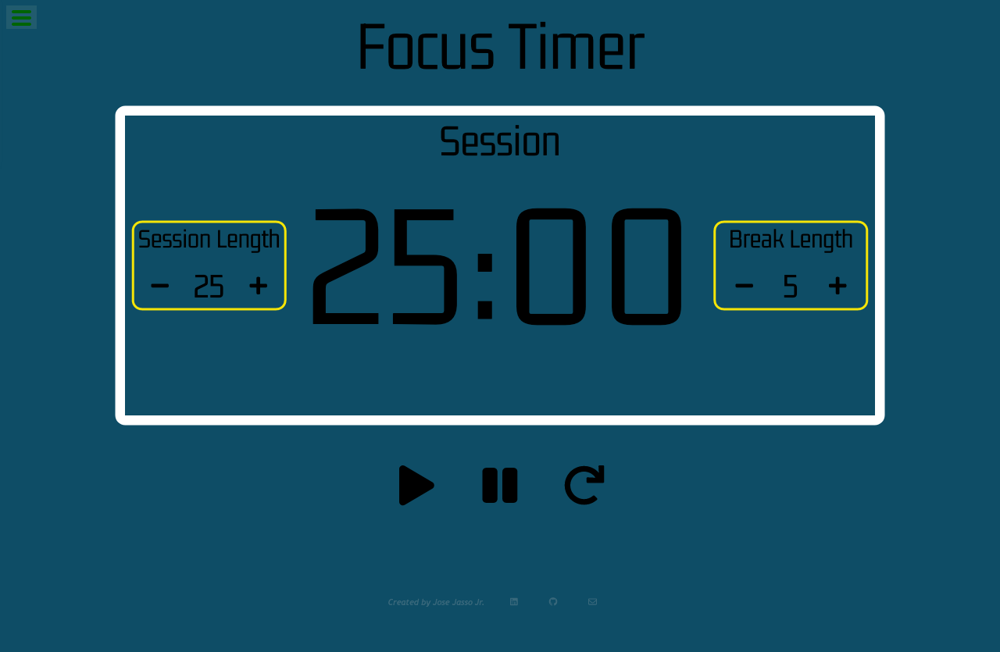

# Jose Jasso Jr. | Focus Timer

An application used while studying or other tasks to time your tasks and breaks in between.

## Techs Used

[React](https://reactjs.org) and CSS

## Preview of Site

## Link to Site
Site can be found on [https://josejassojr.github.io/study-timer/](https://josejassojr.github.io/study-timer/) 

Deployed with [GitHub Pages](https://pages.github.com/)

